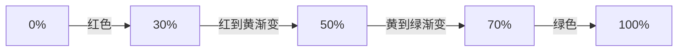
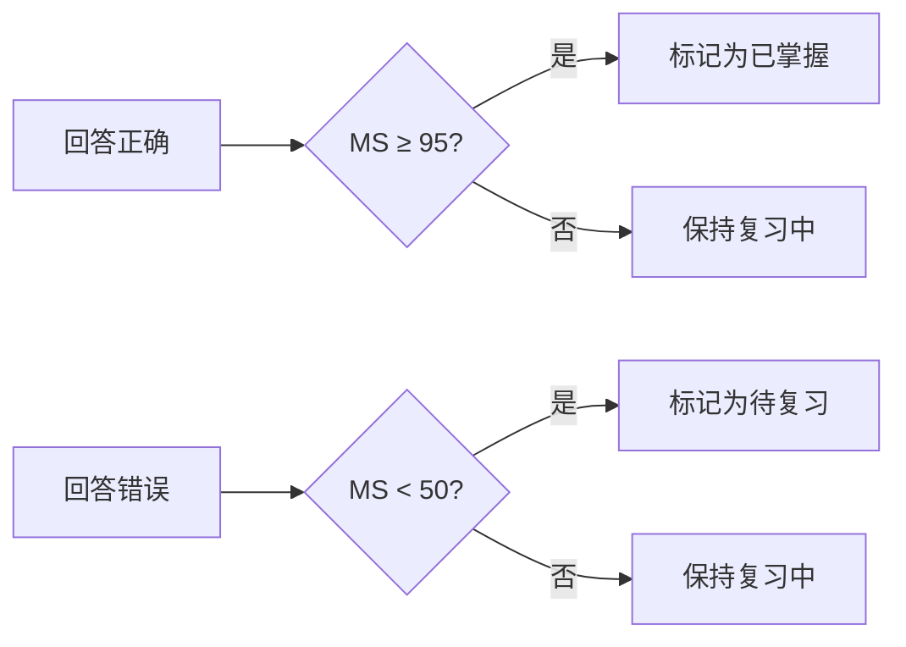
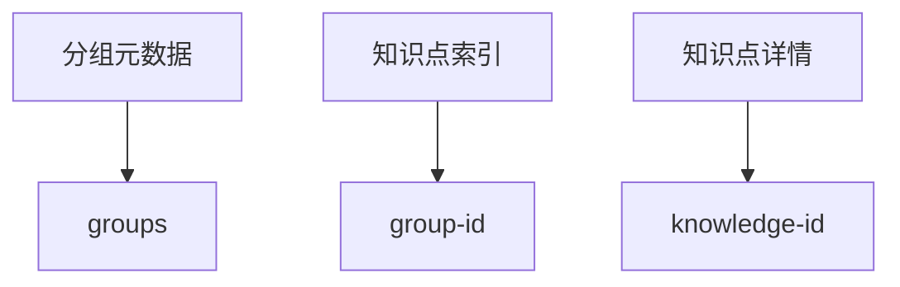
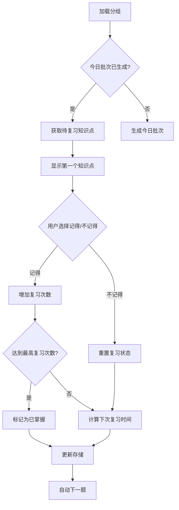
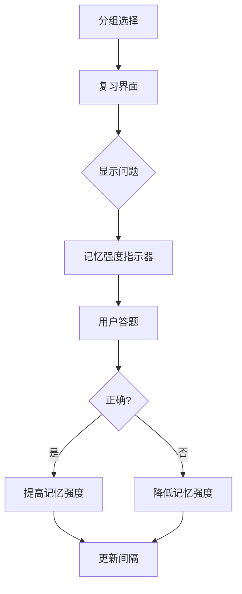

# 艾宾浩斯遗忘曲线记忆小程序

## 项目简介

本项目是基于微信小程序平台开发的知识记忆与复习工具，核心理念源自艾宾浩斯遗忘曲线。用户可以将知识点以"分组"方式管理，通过科学的复习计划，最大化记忆效率。支持知识点的批量导入、分组管理、复习进度追踪等功能。

## 核心功能

### 🗂️ 分组管理
- 创建、重命名和删除知识分组
- 实时显示每个分组的待复习知识点数量
- 知识分组与知识点完全本地存储，保护用户隐私

### 📥 知识导入
- 支持两种导入方式：
  1. **文本输入**：手动输入知识点（问题|||答案格式）
  2. **JSON文件导入**：导入结构化知识点数据
- 分批处理机制：支持大数据量导入，避免界面卡顿
- 进度显示：实时显示导入进度

### 🔁 智能复习系统
- **艾宾浩斯算法**：采用8个复习间隔阶段
  - 5分钟 → 30分钟 → 12小时 → 1天 → 2天 → 4天 → 7天 → 15天 → 30天
- **每日批次限制**：每组每天最多复习20个知识点
- **三种知识点状态**：
  - `pending`：等待首次复习
  - `reviewing`：复习中
  - `mastered`：已掌握
- **自动进度跟踪**：记录每次复习结果和下次复习时间

### 📊 复习统计与可视化
- 实时显示当前复习进度
- **记忆强度指示器**：可视化显示知识点的记忆强度
- 记录历史复习次数和记忆成功率
- 显示上次复习时间间隔

## 最新增强功能

### 视觉记忆强度指示器
- 在复习界面显示记忆强度进度条
- **颜色编码与强度范围**：
  - **弱 (0-30%)**：红色 (#ff6b6b) - 需要重点关注
  - **中 (31-70%)**：黄色 (#ffd166) - 需要定期复习
  - **强 (71-100%)**：绿色 (#06d6a0) - 已牢固掌握
- 实时更新记忆强度百分比
- 帮助用户直观了解知识掌握程度



### 记忆强度算法

记忆强度算法是应用的核心创新，它通过量化用户的记忆状态来优化复习计划。算法包含三个关键组件：

#### 1. 记忆强度动态调整
```math
MS_{new} = 
\begin{cases} 
\min(100, MS + 15 + (D \times 2)) & \text{回答正确} \\
\max(0, MS - 25 - (D \times 3)) & \text{回答错误}
\end{cases}
```
其中：
- `MS` = 当前记忆强度 (0-100)
- `D` = 当前难度系数 (1-5)

#### 2. 难度系数自适应
```math
D_{new} = 
\begin{cases} 
\max(1, D - 0.1) & \text{回答正确} \\
\min(5, D + 0.2) & \text{回答错误}
\end{cases}
```

#### 3. 复习间隔计算
```math
I_{new} = I_{current} \times \left(1 + \frac{MS}{100}\right) \times \left(1.5 - 0.1 \times D\right)
```
其中：
- `I_{new}` = 新复习间隔(分钟)
- `I_{current}` = 当前复习间隔(分钟)

约束条件：5分钟 ≤ I_{new} ≤ 60天

#### 4. 状态转换逻辑


该算法综合考虑了记忆强度、题目难度和历史表现，实现了真正的个性化复习计划。

## 技术实现

### 存储架构
采用**索引-数据分离模型**解决本地存储限制：


**核心数据结构**：
```javascript
// 知识点对象结构
{
  id: Number,           // 唯一ID
  question: String,     // 问题
  answer: String,       // 答案
  groupId: Number,      // 所属分组ID
  addTime: Number,      // 添加时间戳
  nextReviewTime: Number, // 下次复习时间
  reviewCount: Number,  // 复习次数
  history: Array,       // 复习历史 [{time, result}]
  status: String        // 状态: pending/reviewing/mastered
}
```

### 复习算法流程


### 文件结构
```
├── app.js               # 小程序入口
├── app.json             # 全局配置
├── README.md            # 项目文档
├── components/          # 可复用组件
│   └── navigation-bar/  # 自定义导航栏
├── i18n/                # 国际化资源
│   └── base.json        # 基础语言包
├── miniapp/             # 平台特定资源
├── pages/               # 页面组件
│   ├── groups/          # 分组管理
│   ├── import/          # 知识导入
│   ├── review/          # 复习功能
│   ├── mastered/        # 已掌握知识
│   └── index/           # 首页
└── utils/
    └── storage.js       # 数据存储核心逻辑
```

## 界面预览


## 快速开始

### 开发环境
1. 安装微信开发者工具
2. 克隆项目仓库
3. 导入项目目录
4. 点击"编译"预览小程序

### 使用指南
1. **创建分组**：在分组页面输入名称并添加
2. **导入知识**：
   - 文本输入：在输入框按`问题|||答案`格式输入
   - 文件导入：选择JSON格式的知识点文件
3. **开始复习**：
   - 进入分组点击"复习"
   - 根据记忆情况选择"记得"或"不记得"
   - 系统自动安排下次复习时间

## 维护与扩展
- **存储模块**：所有数据操作封装在`utils/storage.js`
- **算法调整**：修改`pages/review/review.js`中的`intervals`数组
- **UI定制**：通过WXSS文件调整样式
- **性能优化**：使用全局缓存减少存储读取

## 注意事项
1. 所有数据存储在本地，卸载小程序将丢失数据
2. 每日复习批次在凌晨自动重置
3. 已掌握知识点可在"已掌握"页面查看

## 艾宾浩斯复习算法说明

本小程序采用基于艾宾浩斯遗忘曲线的**自适应复习间隔算法**，结合记忆强度和难度动态调整每个知识点的下次复习时间，具体如下：

### 1. 复习间隔计算
- 每个知识点有一个 `memoryStrength`（记忆强度，0~100）和 `difficulty`（难度，1~5）。
- 初始复习间隔为 **5分钟**。
- 每次复习后，算法根据记忆强度和难度调整下次复习间隔：

  ```js
  strengthFactor = 1 + (memoryStrength / 100)
  difficultyFactor = 1.5 - (difficulty * 0.1)
  newInterval = currentInterval * strengthFactor * difficultyFactor
  // 间隔被限制在 5分钟~60天 之间
  ```

### 2. 记忆强度与难度调整
- 记住时：记忆强度提升，难度下降，间隔增长更快。
- 没记住时：记忆强度下降，难度上升，间隔增长变慢甚至缩短。

### 3. 复习计划与每日批次
- 每天为每个分组生成一个"今日复习批次"，最多20条。
- 优先推送到期（`nextReviewTime <= 当前时间`）且未掌握的知识点。
- 不足时补充"未复习过"的知识点。
- 每日批次缓存，次日自动刷新。

### 4. 复习举例
假设某知识点初始记忆强度为0，难度为3：

1. **第一次复习**：
   - 初始间隔：5分钟。
   - 记住了，记忆强度提升到15，难度降为2.9。
   - 下次间隔：
     - strengthFactor = 1 + 15/100 = 1.15
     - difficultyFactor = 1.5 - 2.9*0.1 = 1.21
     - newInterval = 5 * 1.15 * 1.21 ≈ 6.96分钟
2. **第二次复习（7分钟后）**：
   - 记住了，记忆强度提升到30，难度降为2.8。
   - 下次间隔：
     - strengthFactor = 1.3
     - difficultyFactor = 1.22
     - newInterval = 6.96 * 1.3 * 1.22 ≈ 11.05分钟
3. **第三次复习（11分钟后）**：
   - 没记住，记忆强度降为0，难度升为3.0。
   - 下次间隔：
     - strengthFactor = 1.0
     - difficultyFactor = 1.2
     - newInterval = 11.05 * 1.0 * 1.2 ≈ 13.26分钟

> 注意：如果多次没记住，间隔会缩短到最小5分钟；多次记住，间隔会逐步拉长，最高可达60天。

### 5. 主要字段
- `memoryStrength`：记忆强度，影响间隔增长速度。
- `difficulty`：难度，影响间隔增长速度。
- `lastInterval`：上一次复习间隔（分钟）。
- `nextReviewTime`：下次复习时间（时间戳）。
