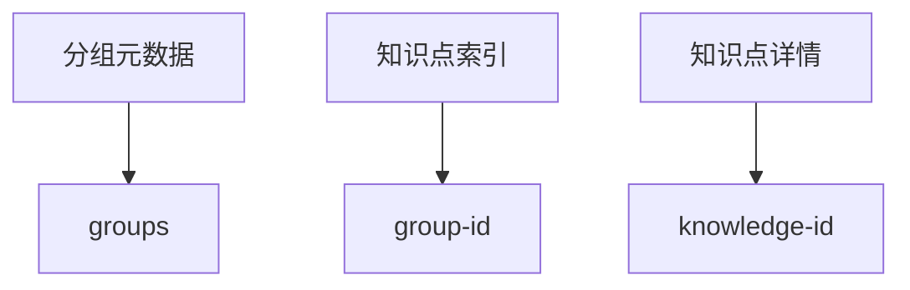
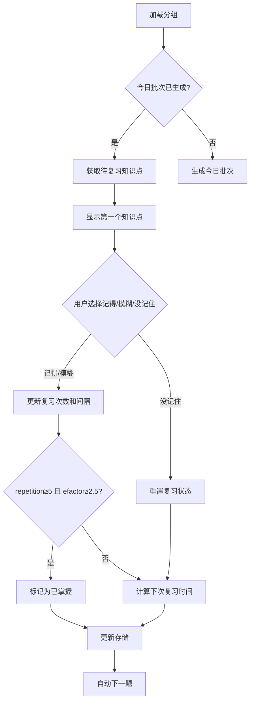
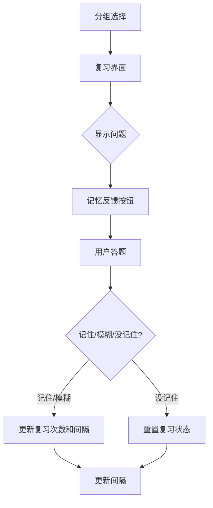

# 记忆大师小程序

## 项目简介

本项目是基于微信小程序平台开发的知识记忆与复习工具，核心理念源自艾宾浩斯遗忘曲线与SM-2（ SuperMemo 2.0）算法。用户可将知识点以"分组"方式管理，通过科学的复习计划，最大化记忆效率。支持知识点的批量导入、分组管理、复习进度追踪等功能。

## 核心功能

### 🗂️ 分组管理
- 创建和删除知识分组
- 实时显示每个分组的待复习知识点数量
- 所有分组与知识点数据完全本地存储，保护用户隐私

### 📥 知识导入
- 支持两种导入方式：
  1. **文本输入**：手动输入知识点
  2. **JSON文件导入**：支持包含多媒体内容的数组对象格式。
- **分批处理机制**：支持大数据量导入，避免界面卡顿
- 进度显示：实时显示导入进度

#### JSON 文件格式说明

**数组对象（支持多媒体）**
，支持为每个知识点添加图片或音频。`media` 字段为可选，且**支持一个知识点同时包含多种媒体类型（如图片和音频）**，前端会全部展示。

```json
[
  {
    "question": "太阳的颜色是什么？",
    "answer": "黄色",
    "media": [
      { "type": "image", "url": "https://example.com/sun.jpg" }
    ]
  },
  {
    "question": "请听音频，回答内容",
    "answer": "音频内容",
    "media": [
      { "type": "audio", "url": "https://example.com/audio.mp3" }
    ]
  },
  {
    "question": "图文音频混合题",
    "answer": "请看图片并听音频回答",
    "media": [
      { "type": "image", "url": "https://example.com/pic.jpg" },
      { "type": "audio", "url": "https://example.com/audio2.mp3" }
    ]
  },
  {
    "question": "没有媒体的问题",
    "answer": "没有媒体的答案"
  }
]
```

> **前端支持说明：**
> - 图片可点击预览，音频可直接播放。

### 🔁 智能复习系统
- **混合SM-2间隔算法**：新知识点前几次复习采用更短间隔，之后进入SM-2个性化间隔。
  - 反馈分为三档：记住了（5分）、模糊（3分）、没记住（1分）。
  - 没记住：下次复习间隔重置为5分钟。
  - 第1次记住：5分钟后复习
  - 第2次记住：30分钟后复习
  - 第3次记住：12小时后复习
  - 第4次记住：1天后复习
  - 第5次记住：6天后复习
  - 第6次及以后：上次间隔×efactor（四舍五入为整数天，efactor初始2.5，最低1.3，动态调整）
  - efactor = efactor + (0.1 - (5 - 反馈分数) × (0.08 + (5 - 反馈分数) × 0.02))，最低1.3
- **每日批次限制**：每组每天最多复习20个知识点，优先推送到期知识点，不足补未复习知识点
- **三种知识点状态**：
  - `pending`：等待首次复习
  - `reviewing`：复习中
  - `mastered`：已掌握
- **自动进度跟踪**：记录每次复习结果和下次复习时间

### 📊 复习统计与可视化
- 实时显示当前复习进度
- 复习历史次数与反馈分数统计
- 显示上次复习时间间隔

## 技术实现

### 存储架构
采用**分组-知识点索引分离模型**解决本地存储限制：


**核心数据结构**：
```javascript
// 知识点对象结构
{
  id: Number,           // 唯一ID
  question: String,     // 问题
  answer: String,       // 答案
  groupId: Number,      // 所属分组ID
  addTime: Number,      // 添加时间戳
  nextReviewTime: Number, // 下次复习时间
  reviewCount: Number,  // 复习次数（部分页面用，实际以history为准）
  history: Array,       // 复习历史 [{time, quality, interval, efactor}]
  status: String,       // 状态: pending/reviewing/mastered
  media: Array,         // 媒体资源 [{type: 'image'|'audio', url: String}]
  learned: Boolean,     // 是否已学习（纳入复习）
  efactor: Number,      // 易记因子（SM-2算法）
  interval: Number,     // 当前间隔（天，SM-2算法）
  repetition: Number    // 连续记住次数（SM-2算法）
}
```

**分组对象结构**：
```javascript
{
  id: Number,           // 唯一ID
  name: String,         // 分组名
  knowledgeCount: Number, // 知识点数量
  dueCount: Number,     // 待复习数量（自动统计）
  learnedCount: Number, // 已学会数量（自动统计）
  unmasteredCount: Number, // 未掌握数量（自动统计）
  createTime: Number    // 创建时间戳
}
```

**全局设置结构**：
```javascript
{
  batchSize: Number,        // 每日复习批次最大数量（默认20）
  efactor: Number,          // 全局默认efactor
  groupEfactorMap: Object   // 分组自定义efactor映射
}
```

### 复习批次刷新机制
- 所有复习批次（reviewList）均在页面 onLoad/onShow 时主动刷新。
- 每个分组每日复习批次缓存于 `todayReviewList-<groupId>`，仅推送到期知识点。
- 页面进入时自动调用 `refreshAllReviewLists`，保证数据实时。

### 批量导入与分块处理
- 支持大批量知识点导入，采用分块异步处理（默认每50条一块），避免UI阻塞。
- 导入时自动分配唯一ID，支持多媒体字段。

### 分组统计与全局缓存
- 全局缓存（如 groupKnowledgeCountMap、groupStats）提升性能，所有页面只读这些统计字段。
- 每个分组对象维护如下统计字段，所有页面只读这些字段，极大提升性能和一致性：
  - `dueCount`：待复习知识点数量（即今日批次中 nextReviewTime <= now 的 learned 且未掌握知识点数）
  - `learnedCount`：已学会知识点数量（learned === true）
  - `unmasteredCount`：未掌握知识点数量（learned === true 且 status !== 'mastered'）
- 统计字段仅在知识点变动时通过 `updateGroupStats` 自动更新，避免全量遍历。
- 所有页面、定时器、复习流程均以 reviewList 为唯一数据源，保证各页面数据一致。
- 定时器机制保证即使页面不重载，dueCount 也能自动刷新。

### 核心API接口说明
- `getAllGroups()`：获取所有分组
- `addGroup(name)`：新增分组
- `updateGroup(group)`：重命名分组
- `removeGroup(id)`：删除分组及其知识点
- `getGroupData(groupId)`：获取分组下所有知识点
- `getGroupDataAsync(groupId)`：异步获取分组知识点
- `addKnowledgeBatchToGroup(groupId, batch)`：批量导入知识点
- `saveKnowledge(knowledge)`：保存/更新知识点
- `removeKnowledge(groupId, knowledgeId)`：删除知识点
- `getTodayReviewList(groupId)`：获取今日复习批次
- `refreshAllReviewLists()`：刷新所有分组的今日复习批次（页面onLoad时调用）
- `updateKnowledgeBySM2(knowledge, quality)`：按SM-2算法更新知识点状态
- `getUnlearnedBatch(groupId, batchSize)`：获取未学会知识点一批
- `getUnlearnedCount(groupId)`：获取未学会知识点总数
- `refreshAllReviewListsAsync()`：异步刷新所有分组的今日复习批次，适合大数据量场景。
- `processInChunks(items, processFn, chunkSize)`：通用分块处理函数，批量导入等场景使用。
- `reportPerf()`：输出性能监控日志，便于开发调优。

### 复习算法流程


### 复习算法说明

本小程序采用基于艾宾浩斯遗忘曲线的**SM-2混合间隔算法**，每个知识点有efactor、interval、repetition等字段，具体如下：

- 反馈分数（quality）：5=记住了，3=模糊，1=没记住
- 前5次复习间隔分别为5分钟、30分钟、12小时、1天、6天
- 第6次及以后：上次间隔×efactor（四舍五入为整数天）
- efactor初始2.5，最低1.3，按如下公式动态调整：
  ```
  efactor = efactor + (0.1 - (5 - 反馈分数) × (0.08 + (5 - 反馈分数) × 0.02))
  efactor >= 1.3
  ```
- 只要一次没记住，间隔重置为5分钟，efactor下降
- 每日批次最多20条，优先推送到期知识点，不足补未复习知识点
- 复习历史记录结构：
  - 复习时间（time）
  - 反馈分数（quality）
  - 间隔（interval，天）
  - efactor

> **切换为"已掌握"条件说明：**
> - 只有当某知识点连续5次记住（repetition≥5），且efactor≥2.5时，才会被标记为"已掌握"（mastered），不再进入常规复习队列。
> - 该条件比单纯"复习次数达标"更严格，确保只有真正熟练且记忆强度高的知识点才会被判定为已掌握。


### 算法来源
<https://supermemo.guru/wiki/SuperMemo_Guru>

### 文件结构
```
├── app.js               # 小程序入口
├── app.json             # 全局配置
├── README.md            # 项目文档
├── components/          # 可复用组件
│   ├── navigation-bar/  # 自定义导航栏
│   └── icons/           # 图标资源
├── ec-canvas/                # ECharts图表支持
│   ├── ec-canvas.js
│   ├── echarts.js
│   └── wx-canvas.js
├── i18n/                # 国际化资源
│   └── base.json        # 基础语言包
├── miniapp/             # 平台特定资源
│   ├── android/
│   └── ios/
├── pages/
│   ├── groups/               # 分组管理
│   ├── import/               # 知识导入
│   ├── learn/                # 新知识学习
│   ├── review/               # 智能复习
│   ├── mastered/             # 已掌握知识
│   ├── history/              # 复习历史统计
│   ├── settings/             # 全局设置
│   └── index/                # 首页
├── utils/
│   ├── storage.js            # 数据存储与核心API
│   ├── lru.js                # LRU缓存
│   └── swipeHint.js          # 滑动手势提示
├── tests/                    # 单元测试
│   └── storage.test.js
└── ...
```

## 界面预览


## 快速开始

### 开发环境
1. 安装微信开发者工具
2. 克隆项目仓库
3. 导入项目目录
4. 点击"编译"预览小程序

### 使用指南
1. **创建分组**：在分组页面输入名称并添加
2. **导入知识**：
   - 文本输入：在输入框按格式输入
   - 文件导入：选择JSON格式的知识点文件
3. **开始复习**：
   - 进入分组点击"复习"
   - 根据记忆情况选择"记住了"、"模糊"或"没记住"
   - 系统自动安排下次复习时间

## 维护与扩展
- **存储模块**：所有数据操作封装在`utils/storage.js`
- **算法调整**：修改`utils/storage.js`中的`updateKnowledgeBySM2`函数
- **UI定制**：通过WXSS文件调整样式
- **性能优化**：使用全局缓存减少存储读取

## 调测

### 性能监控日志开启示例
```js
// 在设置页面或开发环境中可开启性能日志
const storage = require('../../utils/storage');
storage.getSettings().enablePerfLogging = true;
storage.reportPerf();
```

## 测试

### 依赖安装
```bash
npm install
```

### 单元测试
```bash
# 运行 tests/storage.test.js 进行核心存储逻辑测试
npm test
```
## 注意事项
1. 所有数据存储在本地，卸载小程序将丢失数据

---

## 新增与优化说明（2024年6月）

### 新增页面与功能
- **历史统计页面（pages/history/history）**：展示每个知识点的复习历史、间隔、反馈分数等，支持分页和可视化。
- **设置页面（pages/settings/settings）**：支持全局参数（如每日批次、efactor等）自定义，部分参数可持久化到本地。
- **首页（pages/index/index）**：作为小程序入口，聚合各分组、复习入口等。
- **滑动手势提示（utils/swipeHint.js）**：学习/复习页面支持滑动手势，提升交互体验。

### 性能与架构优化
- **LRU缓存机制（utils/lru.js）**：对分组和知识点数据引入LRU缓存，提升本地存储读取性能，减少I/O。
- **性能监控与日志（storage.js）**：支持性能指标统计与日志输出（如缓存命中率、读写耗时、内存占用等），可通过设置开关。
- **分块异步处理**：批量导入知识点时采用分块异步（默认每50条），避免UI卡顿。
- **支持异步获取分组知识点**：如`getGroupDataAsync`，适配大数据量和异步场景。

### 兼容性与平台适配
- **支持微信小程序或Android平台**，部分导入逻辑根据平台自动适配（如wx.miniapp.chooseFile、wx.chooseMessageFile等）。


### 性能监控与缓存机制
- 项目引入LRU缓存（分组100条、知识点500条），极大提升性能。
- 支持性能日志开关（enablePerfLogging），可在设置中开启，开发调试时建议打开。
- 性能日志包括缓存命中率、读写耗时、内存占用、存储配额等。


## 下一步计划
引入FSRS（Free Spaced Repetition Scheduler）算法
<https://github.com/open-spaced-repetition/fsrs4anki>
